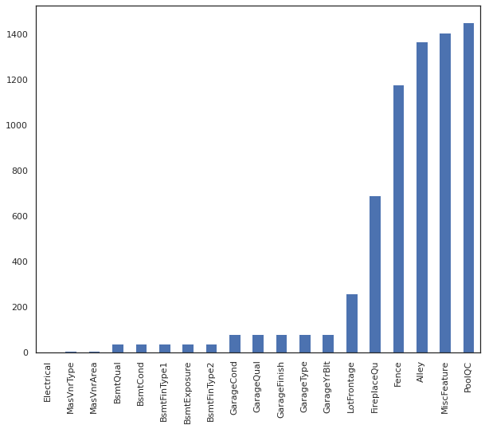

# Project Overview 
With 79 explanatory variables describing (almost) every aspect of residential homes in Ames, Iowa, this project aims to predict the final price of each home.

# Objective
1. Project aims to allow business to train and predict house prices in two ways as they wish

    - as a regression problem

    - as a classification problem (by binning the prices into 4 categorical quartiles)

    - user can also specify the number of cross validation folds to train the model

2. Project also aims to run Random Forest and XGB models using RandomizedSearchCV to reach the best model. Hyperparameters can be easily configured by users via config.json.

3. Project aims to save most optimized model, after training, so that user can use it to get predicted results on unseen data. 

# Code and Resources
- **Python version**: 3.8.5

- **Packages**: pandas, numpy, matplotlib, seaborn, sklearn, json, joblib

- **Kaggle source**: https://www.kaggle.com/c/home-data-for-ml-course

- **Github repo**: https://github.com/chekwei4/Housing_Prediction

# File structure

```
|-- src
    |-- main.py
    |-- model.py
    |-- process_data.py
|-- data
    |-- train_val.csv
    |-- test.csv 
|-- model
    |-- joblib_xgb_cla_model.pkl
    |-- joblib_xgb_model.pkl
    |-- processed_columns.txt
|-- prediction
    |-- prediction.csv
|-- README.md
|-- run.sh
|-- requirements.txt
|-- Housing_Prediction_EDA.ipynb
|-- config.json
```

# Exploratory Data Science
Below are some of the highlights from EDA. 

1. Missing value analysis



<!--  -->

2. Features which are correlated to dependent feature aka SalePrice


3. Features which are dominated by large number of single value

    
    
    

**Full EDA ipynb**: https://github.com/chekwei4/Housing_Prediction/blob/master/Housing_Prediction_EDA.ipynb

# Data Processing

Few data processing steps to highlight below: 

## Drop features that are 
1. dominated by single value

```
BsmtFinSF2, LowQualFinSF, EnclosedPorch, 3SsnPorch, ScreenPorch, PoolArea, MiscVal, BsmtHalfBath, KitchenAbvGr, Street, Utilities, Condition2, RoofMatl, Heating, Functional, GarageQual, GarageCond 
```
2. high correlations with other features
```
GarageYrBlt, 1stFlrSF, TotRmsAbvGrd, GarageArea
```

3. large amount of missing values
```
PoolQC, MiscFeature, Alley, Fence, FireplaceQu
```

## Create new features
1. This creates a new feature which sum the lot space.
```
df['LotTotalArea'] = df['LotFrontage'] + df['LotArea']
```
2. This creates a new feature which sum the basement space.
```
df['BsmtTotalArea'] = df['TotalBsmtSF'] + df['BsmtUnfSF'] + df['BsmtFinSF1']
```
3. This creates a new feature which of total baths in the house.
```
df['TotalBathAbvGr'] = df['FullBath'] + df['HalfBath']
```

## Impute missing values
1. For numerical features, missing values are imputed with mode value.

2. For categorical features, missing values are imputed with "NA".

## Encode categorical features
1. Ordinal features are encoded to maintain the ranking integrity.

```
ExterQual, ExterCond, BsmtQual, BsmtCond, HeatingQC, KitchenQual, BsmtFinType1, BsmtFinType2, BsmtExposure
```

2. Other nominal features are encoded via one-hot encoding.  

## Binning the features
For classification approach, the SalePrice are binned into 4, based on the quartiles. 

0: min - 25%

1: 25% - 50%

2: 50% - 75%

3: 75% - max


# Modelling
I standardized the continuous features, and I split the train data into training and validation set, into 30%-70%. Some baseline models were created before finalising on few better ones. 

For Regression, models were built with Random Forest, SVM, XGB regressors. 

For Regression approach, the key metric to evaluate the model results was Mean Absolute Error.

MAE measures the average magnitude of the errors in a set of predictions, without considering their direction.

I chose MAE because it was easier to interpret, and as we are doing price predictions, I decided that direction of difference between prediction and actual price need not matter. (Eg. 
A $1000 prediction that is more or less than actual is disregarded)

For Clasisification, Random Forest, XGB, Naive Bayes, KNN and Decision Trees were built during experiement phase. Ultimately, only RF and XGB models were retained as they yield better results at baseline. 

For Regression approach, the key metric to evaluate the model results was accuracy score.


# Getting Started - Instruction
## Model training
### Regression with Random Forest or XGB (with cross validation = 10)
```
python -m src.main -mode train -csv data/train_val.csv -app reg -model rf -cv 10
python -m src.main -mode train -csv data/train_val.csv -app reg -model xgb -cv 10
```
### Classification with Random Forest or XGB (with cross validation default = 5)
```
python -m src.main -mode train -csv data/train_val.csv -app cla -model rf 
python -m src.main -mode train -csv data/train_val.csv -app cla -model xgb
```

## Inferencing / Predicting unseen data set
### Prediction outcome: Regression
```
python -m src.main -mode predict -csv data/test.csv -app reg
```
### Prediction outcome: Classification
```
python -m src.main -mode predict -csv data/test.csv -app cla
```

# Output
CSV file generated after running predict mode via Regression approach, as this is fundamentally a regression problem. 

Kaggle competition submission friendly. 
```
|-- prediction
    |-- prediction.csv
```
# Results
## Training results

**Random Forest Regression**: MAE = 17875

**XGB Regression**: MAE = 17653

**Random Forest Classification**: Accuracy = 0.783

**XGB Classification**: Accuracy = 0.759

## Test results

**Kaggle Competition**: Score = 16439.73467 (26th percentile)


# Future Enhancements (Good to have)
1. To build a client facing API using flask

2. GridSearchCV to obtain better hyperparameters for models

3. Better handle and get info from temoporal features (Eg. GarageYrBuilt, YrSold)

4. Explore other feature scaling methods, and more thoughts into data cleaning and better feature selection via Lasso

# Useful Links
- Google Python style guide https://google.github.io/styleguide/pyguide.html
